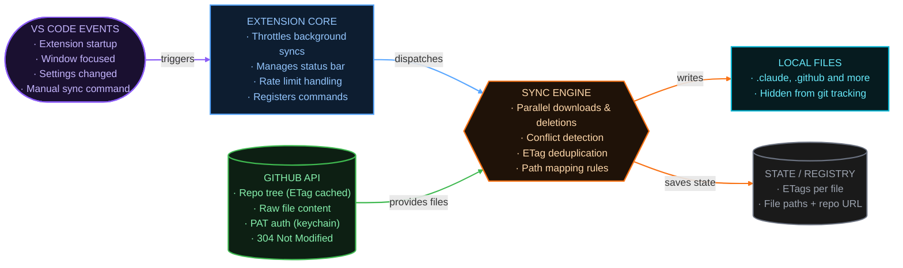

  
  <h1>AI Setup Sync</h1>
  
<strong>One repo. Every project. Always in sync.</strong>

  
  
  
  

Every AI coding tool needs its own config files in every repo. AI Setup Sync maintains yours once
in a GitHub repository and distributes it automatically across every project — Claude Code, GitHub
Copilot, Cursor, Google Antigravity, Gemini CLI, OpenAI Codex, and more. No copy-pasting.

> 📖 For installation, settings, path mappings, conflict handling, and the FAQ, see **[extension/README.md](extension/README.md)**.

## What it does

- **Syncs automatically** — pulls from your GitHub repo on project open and window focus.
- **Protects your Intellectual Property** — your AI setup lives in your own private repository, syncs automatically into each project, and is excluded from git. Your instructions never touch a client's codebase.
- **Supports every tool** — any file-based AI config works out of the box (Claude Code, Copilot, Cursor, and more). Custom path mappings cover anything else.
- **Protects local edits** — detects files you've changed and prompts before overwriting, with a built-in diff.
- **Stays out of git** — synced files are added to `.git/info/exclude`, never cluttering your changes.
- **Works across parallel agent sessions** — synced configs are automatically available in every Claude Code and Codex worktree, so AI tools have your setup no matter which isolated session they run in.

## How it works

Sync triggers automatically on startup, window focus, and settings changes. Push to your config repo and every project picks up the change on the next sync — here's how the pieces connect:

## Install

1. Install from the [VS Code Marketplace](https://marketplace.visualstudio.com/items?itemName=olekpuchka.ai-setup-sync)
   (or search **AI Setup Sync** in the Extensions view).
2. Set `aiSetupSync.repository` to your GitHub repository URL in VS Code **user** settings.
3. Open a project — sync runs automatically.

For private repos, SSO-protected orgs, or GitHub Enterprise Server, add a token — see the
[full setup guide](extension/README.md#setting-up-your-repository).

## Contributing

Pull requests are welcome for features, bug fixes, and documentation. See
[CONTRIBUTING.md](CONTRIBUTING.md) for local setup, project architecture, and PR guidelines.

## License

Released under the [MIT License](LICENSE) — free to use, modify, and distribute.
